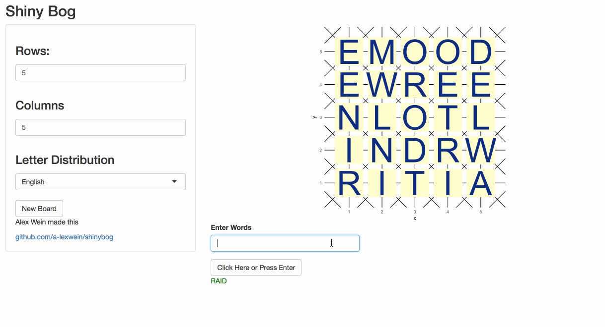

### Go play now: [alexwein.shinyapps.io/shinybog](https://alexwein.shinyapps.io/shinybog)

This is a relaxing, customizable one player word game, that you'll be familiar with if you've played Boggle. It lets you:

* Generate a grid of letters based on input for grid size and letter distribution.
* Type in a word to verify if its on the board, and if it's a valid English word.

Undearneath the hood, this app:

* Scrapes letter frequency data from Wikipedia
* Uses Tidyverse and Shiny frameworks within R to generate images representing word grids based on user input
* Uses Javascript to extend functionality to Shiny
* Defines a graph traversal algorithm to check whether a given word is on a grid
* Uses a trie to quickly determine whether a string is in a word list used for competetive Scrabble



# Run Locally
To run this app locally from your R console:
```{r, eval = FALSE}
require('shiny')
runGitHub('~/codes/bog/shinybog')
```

# Description
Over my lifetime, my most consistent diversion has been finding words in grids.  I've been playing variants on the classic word game Boggle since my childhood, and have racked up tens of thousands of games online over about twenty years. I don't play as much as used to, but Boggle remains an immensely satisfying mental exercise, and has been regular inspiration in my life as programmer.

The letter distribution comes from [a table on letter frequency from Wikipedia](http://en.wikipedia.org/wiki/Letter_frequency).  When this app's server fires up, it loads the Wikipedia page, scrapes the table, and builds a function that produces random letters based on a given language's distribution.  I didn't put a lot of work into ensuring data quality, and changes to the Wikipedia page could definitely break the app.

The board is modeled as a tidy dataset: for a 5 x 6 board, there are 30 rows, each with x and y coordinates and a letter determined through the distribution.  Once we have data in this format, we can graph it using ggplot2, generating the images you see on the page.  If you're unfamiliar with ggplot2, it's an elegant data visualization library with a grammar-based approach to building up charts from smaller components. The visual representation of the board is essentially a scatterplot with large squares for dots and text labels. I've added sets of horizontal, vertical, and diagonal lines in the background along with some other styling.

Once a board is displayed, the user types guesses into the text input. I used shinyjs and JQuery to enable submission through pressing "enter", as well as to display all guesses below the board.  Once the user enters in a string, the server checks whether it is on the board.  If so, it checks whether the word is valid English (based on a competetive Scrabble dictionary).  Then the guess is displayed below the board, and will be green if the word is Enlgish and on the board.

The function to evaluate whether a given word is on a given grid is a recursive depth first search over a space that can be thought of as a non-directed graph. Spots in the middle of the board are connected to eight neighbors within one row and one column.  The algorithm starts paths everywhere onthe board that the first letter of the word appears.  Each path checks for the next letter. If it doesn't connect, the path dies.  If it connects to exactly one spot, the path continues of there, being sure not to check spots in the active path. If the path can connect to multiple spots, we branch and explore both paths.

The function to evaluate whether a given word is valid English is a very simple implementation of the tribeard package. Tries have very fast lookup time: the `is_english()` is constant with respect to the number of valid English words, and linear with respect to the number of characters in the target word. A next step is to leverage tries to write an efficient solver function to find all valid words on a given board.

## Thanks
Deploying with shinyapps.io wasn't much harder than pressing a button, and the all the RStudio documentation and community around the Tidyverse and Shiny are superb. [Dean Attali's](https://deanattali.com) work on Shiny and Javascript has been a huge help. Also thanks to my instructors and classmates at Hack Reactor, and my online Boggle crew.

Anybody who wants to chat word games and the Tidyverse: I'm alexwein at gmail.


